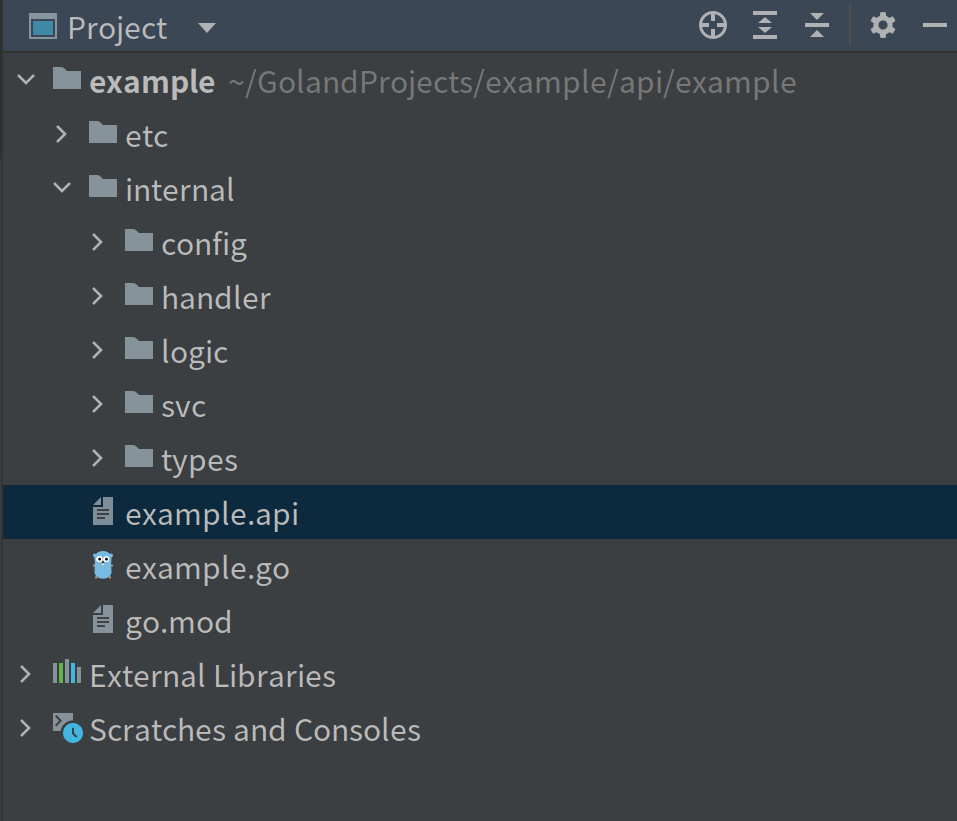

# Step by step develop API service 

> Make sure that you have been installed follow software:
- simple-admin-tool (goctls)

> Create api project \
Create example project
```shell
goctls api new example
```
>You can see the struct



> The go.mod is 

```shell
module example

go 1.19

```

> You should run command, to replace go-zero

```shell
goctls migrate --zero-version v1.4.1 --tool-version v0.0.6
```

> The version you can go to the github to find the latest release. \
After running the command, the mod file becomes:

```text
module example

go 1.19

require (
	github.com/suyuan32/simple-admin-tools/plugins/registry/consul v0.0.0-20220923153137-c2cafa96657e
	github.com/zeromicro/go-zero v1.4.1
)

require (
	github.com/Knetic/govaluate v3.0.1-0.20171022003610-9aa49832a739+incompatible // indirect
	github.com/armon/go-metrics v0.4.0 // indirect
	github.com/beorn7/perks v1.0.1 // indirect
	github.com/casbin/casbin/v2 v2.52.1 // indirect
	github.com/casbin/gorm-adapter/v3 v3.7.4 // indirect
	github.com/cenkalti/backoff/v4 v4.1.3 // indirect
	github.com/cespare/xxhash/v2 v2.1.2 // indirect
	github.com/denisenkom/go-mssqldb v0.12.0 // indirect
	github.com/fatih/color v1.13.0 // indirect
	github.com/glebarez/go-sqlite v1.16.0 // indirect
	github.com/glebarez/sqlite v1.4.3 // indirect
	github.com/go-logr/logr v1.2.3 // indirect
	github.com/go-logr/stdr v1.2.2 // indirect
	github.com/go-playground/locales v0.14.0 // indirect
	github.com/go-playground/universal-translator v0.18.0 // indirect
	github.com/go-playground/validator/v10 v10.11.1 // indirect
	github.com/go-sql-driver/mysql v1.6.0 // indirect
	github.com/golang-jwt/jwt/v4 v4.4.2 // indirect
	github.com/golang-sql/civil v0.0.0-20220223132316-b832511892a9 // indirect
	github.com/golang-sql/sqlexp v0.0.0-20170517235910-f1bb20e5a188 // indirect
	github.com/golang/protobuf v1.5.2 // indirect
	github.com/google/uuid v1.3.0 // indirect
	github.com/grpc-ecosystem/grpc-gateway/v2 v2.7.0 // indirect
	github.com/hashicorp/consul/api v1.15.2 // indirect
	github.com/hashicorp/go-cleanhttp v0.5.2 // indirect
	github.com/hashicorp/go-hclog v1.2.0 // indirect
	github.com/hashicorp/go-immutable-radix v1.3.1 // indirect
	github.com/hashicorp/go-rootcerts v1.0.2 // indirect
	github.com/hashicorp/golang-lru v0.5.4 // indirect
	github.com/hashicorp/serf v0.9.8 // indirect
	github.com/jackc/chunkreader/v2 v2.0.1 // indirect
	github.com/jackc/pgconn v1.12.1 // indirect
	github.com/jackc/pgio v1.0.0 // indirect
	github.com/jackc/pgpassfile v1.0.0 // indirect
	github.com/jackc/pgproto3/v2 v2.3.0 // indirect
	github.com/jackc/pgservicefile v0.0.0-20200714003250-2b9c44734f2b // indirect
	github.com/jackc/pgtype v1.11.0 // indirect
	github.com/jackc/pgx/v4 v4.16.1 // indirect
	github.com/jinzhu/inflection v1.0.0 // indirect
	github.com/jinzhu/now v1.1.5 // indirect
	github.com/jpillora/backoff v1.0.0 // indirect
	github.com/leodido/go-urn v1.2.1 // indirect
	github.com/mattn/go-colorable v0.1.12 // indirect
	github.com/mattn/go-isatty v0.0.14 // indirect
	github.com/matttproud/golang_protobuf_extensions v1.0.2-0.20181231171920-c182affec369 // indirect
	github.com/mitchellh/go-homedir v1.1.0 // indirect
	github.com/mitchellh/mapstructure v1.5.0 // indirect
	github.com/openzipkin/zipkin-go v0.4.0 // indirect
	github.com/pelletier/go-toml/v2 v2.0.5 // indirect
	github.com/pkg/errors v0.9.1 // indirect
	github.com/prometheus/client_golang v1.13.0 // indirect
	github.com/prometheus/client_model v0.2.0 // indirect
	github.com/prometheus/common v0.37.0 // indirect
	github.com/prometheus/procfs v0.8.0 // indirect
	github.com/remyoudompheng/bigfft v0.0.0-20200410134404-eec4a21b6bb0 // indirect
	github.com/spaolacci/murmur3 v1.1.0 // indirect
	github.com/suyuan32/simple-admin-core v0.0.4 // indirect
	go.opentelemetry.io/otel v1.10.0 // indirect
	go.opentelemetry.io/otel/exporters/jaeger v1.10.0 // indirect
	go.opentelemetry.io/otel/exporters/otlp/internal/retry v1.10.0 // indirect
	go.opentelemetry.io/otel/exporters/otlp/otlptrace v1.10.0 // indirect
	go.opentelemetry.io/otel/exporters/otlp/otlptrace/otlptracegrpc v1.10.0 // indirect
	go.opentelemetry.io/otel/exporters/zipkin v1.10.0 // indirect
	go.opentelemetry.io/otel/sdk v1.10.0 // indirect
	go.opentelemetry.io/otel/trace v1.10.0 // indirect
	go.opentelemetry.io/proto/otlp v0.19.0 // indirect
	go.uber.org/automaxprocs v1.5.1 // indirect
	golang.org/x/crypto v0.0.0-20220722155217-630584e8d5aa // indirect
	golang.org/x/net v0.0.0-20220531201128-c960675eff93 // indirect
	golang.org/x/sys v0.0.0-20220520151302-bc2c85ada10a // indirect
	golang.org/x/text v0.3.7 // indirect
	google.golang.org/genproto v0.0.0-20220602131408-e326c6e8e9c8 // indirect
	google.golang.org/grpc v1.49.0 // indirect
	google.golang.org/protobuf v1.28.1 // indirect
	gopkg.in/yaml.v2 v2.4.0 // indirect
	gorm.io/driver/mysql v1.3.6 // indirect
	gorm.io/driver/postgres v1.3.9 // indirect
	gorm.io/driver/sqlserver v1.3.2 // indirect
	gorm.io/gorm v1.23.8 // indirect
	gorm.io/plugin/dbresolver v1.1.0 // indirect
	modernc.org/libc v1.15.1 // indirect
	modernc.org/mathutil v1.4.1 // indirect
	modernc.org/memory v1.0.7 // indirect
	modernc.org/sqlite v1.16.0 // indirect
)

replace github.com/zeromicro/go-zero v1.4.1 => github.com/suyuan32/simple-admin-tools v0.0.6

```

> And then edit etc/example.yaml

```yaml
Name: example.api
Host: 127.0.0.1
Port: 9100
Timeout: 30000
```

> And then you can run the code !

```shell
go run example.go -f etc/example.yaml
```

> You can see

```shell
Starting server at 127.0.0.1:9100...
```

That means it runs successfully.