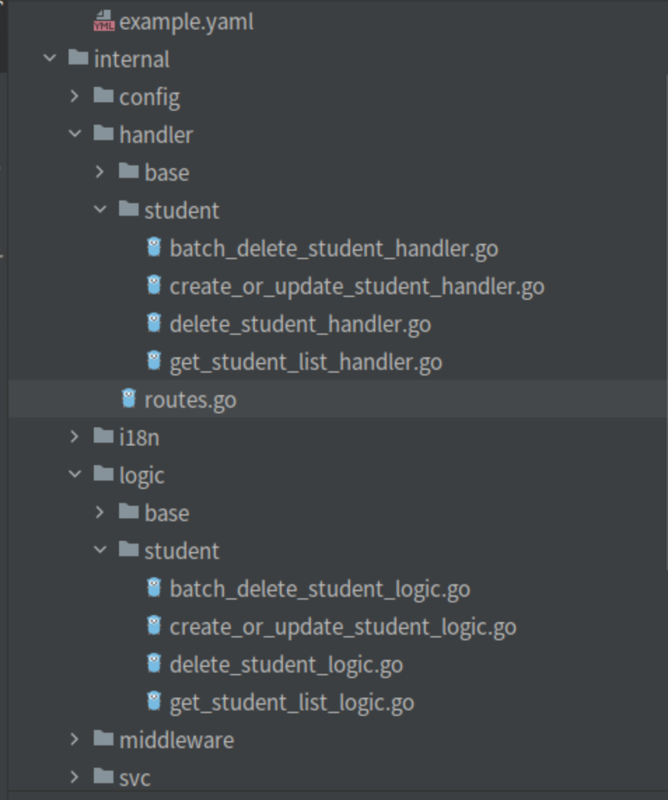

# 3 minutes developing API service

Make sure that you have been installed follow software:
- simple-admin-tool (goctls) v0.1.0 +


## Create API project
> Create example project
```shell
goctls api new example --i18n=true --casbin=true --goZeroVersion=v1.4.2 --toolVersion=v0.1.2 --transErr=true --moduleName=github.com/suyuan32/simple-admin-example-api --port=8081

```

### Parameters

| Parameter	    | Introduction                 | Usage                                                                                               |
|---------------|------------------------------|-----------------------------------------------------------------------------------------------------|
| i18n          | Whether to use i18n          | true means use                                                                                      |
| casbin        | Whether to use casbin        | true means use                                                                                      |
| moduleName    | module name in  go.mod       | If your project will be used by other project, you should set as above which is a github repository |
| goZeroVersion | go zero version              | Go to [go-zero](https://github.com/zeromicro/go-zero/releases) to get the latest release            |
| toolVersion   | simple admin tools version   | Go to [tool](https://github.com/suyuan32/simple-admin-tools/releases) to get the latest release     |
| transErr      | Whether to use i18n in error | true means use                                                                                      |
| port          | port number                  | The service port                                                                                    |


> You can see the project structure:


> And then edit etc/example.yaml

```yaml
Name: example.api
Host: 0.0.0.0
Port: 8081
Timeout: 30000

Auth:
  AccessSecret: # the same as core
  AccessExpire: 259200

Log:
  ServiceName: exampleApiLogger
  Mode: file
  Path: /home/ryan/data/logs/example/api
  Level: info
  Compress: false
  KeepDays: 7
  StackCoolDownMillis: 100

Prometheus:
  Host: 0.0.0.0
  Port: 4000
  Path: /metrics


RedisConf:
  Host: 127.0.0.1:6379
  Type: node

DatabaseConf:
  Type: mysql
  Host: 127.0.0.1
  Port: 3306
  DBName: simple_admin
  Username: root # set your username
  Password: "123456" # set your password
  MaxOpenConn: 100
  SSLMode: false
  CacheTime: 5

CasbinConf:
  ModelText: |
    [request_definition]
    r = sub, obj, act
    [policy_definition]
    p = sub, obj, act
    [role_definition]
    g = _, _
    [policy_effect]
    e = some(where (p.eft == allow))
    [matchers]
    m = r.sub == p.sub && keyMatch2(r.obj,p.obj) && r.act == p.act

ExampleRpc:
  Endpoints:
    - 127.0.0.1:8080
```

> Run the command below:

```shell
go run example.go -f etc/example.yaml
```

> If you see the information below:

```shell
Starting server at 127.0.0.1:8081...
```

That means running successfully.

## Code generation（based on Proto file）

```shell
goctls api proto --proto=/home/ryan/GolandProjects/simple-admin-example-rpc/example.proto --style=go_zero --serviceName=example --o=./ --model=Student --rpcName=Example --grpcPackage=github.com/suyuan32/simple-admin-example-rpc/example
```
| Parameters  | Introduction               | Usage                                                                                   |
|-------------|----------------------------|-----------------------------------------------------------------------------------------|
| proto       | Proto file path            | Input the absolute path of proto file                                                   |
| style       | File name format           | The go_zero means snack format                                                          |
| serviceName | Service name               | The same as the name when use new to generate. e.g. example.go's serviceName is example |
| o           | Output path                | The output path，it can be relative path. It should target to the root path of project.  |
| model       | Model name                 | The structure name in schema，e.g. the Student in example peoject                        |
| rpcName     | RPC name                   | Input Example will generate l.svcCtx.ExampleRpc                                         |
| grpcPackage | RPC *_grpc.go package path | In example project is github.com/suyuan32/simple-admin-example-rpc/example              |

The codes generated is like below:



> See more detail in simple admin example api URL https://github.com/suyuan32/simple-admin-example-api

You need to add ExampleRpc manually into service_context, config, etc.