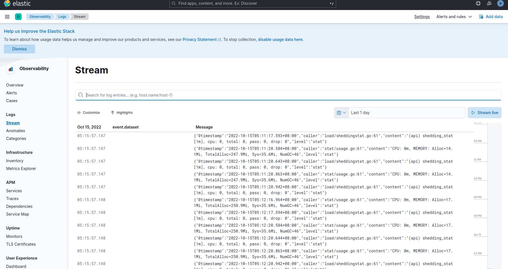

# Log Collecting

> We use EFK to do the log collecting.

- Elasticsearch
- Filebeat
- Kibana

> Installation

- [Elasticsearch](https://www.elastic.co/guide/en/elasticsearch/reference/current/docker.html)
- [Filebeat](https://www.elastic.co/guide/en/beats/filebeat/current/filebeat-installation-configuration.html)
- [Kibana](https://www.elastic.co/guide/en/kibana/current/docker.html)

> Install step in test env \
> Docker

```shell
# es
docker run --name es01 --net elastic -p 9200:9200 -p 9300:9300 -e ES_JAVA_OPTS="-Xms1g -Xmx1g" -m 3g -it docker.elastic.co/elasticsearch/elasticsearch:8.4.3

# kibana
docker run --name kib-01 --net elastic -p 5601:5601 docker.elastic.co/kibana/kibana:8.4.3
```

> Filebeat

Modify filebeat-deploy.yaml， which is in simple-admin-core/deploy/k8s/log-collection/filebeat/
> You can add other log path for other api service， default only having core logs.

```yaml
 - type: log
      paths:
        - /home/data/logs/core/*/*.log
```

> Configure environment variables

```yaml
          env:
            - name: ELASTICSEARCH_HOST   
              value: "192.168.50.216"  # ES address
            - name: ELASTICSEARCH_PORT
              value: "9200"  # ES port
            - name: ELASTICSEARCH_USERNAME
              value: elastic # ES username
            - name: ELASTICSEARCH_PASSWORD
              value: UQ==CXXjw47bK_I13*f1 # password
            - name: ELASTICSEARCH_CA_FINGERPRINT
              value: 8d6aed6bba745f2f0aaa46f628e3124c82ae6727c1f5e207e3d821ffeefb5e5e # trust CA's fingerprint
            - name: ELASTIC_CLOUD_ID 
              value: # cloud ID， optional
            - name: ELASTIC_CLOUD_AUTH 
              value: # cloud Token， optional
```

> Install filebeat via script

```shell
# Enter simple-admin-core/deploy/k8s/log-collection/filebeat
kubectl apply -f filebeat-deploy.yaml
```

> Preview in kibana

