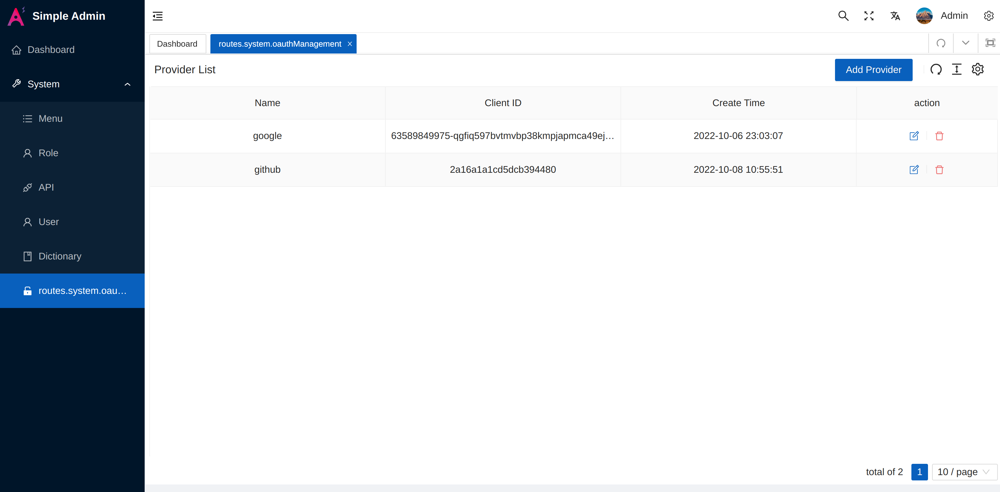

# Oauth

> The system offer google and github Oauth log in by default

> How to get clientID and client secret?
[google](https://developers.google.com/identity/protocols/oauth2)
[github](https://docs.github.com/en/developers/apps/building-oauth-apps/authorizing-oauth-apps)

> Add provider



> Edit src/views/sys/login/LoginForm.vue

```html
<div class="flex justify-evenly enter-x" :class="`${prefixCls}-sign-in-way`">
  <GithubFilled @click="oauthLoginHandler('github')" />
  <WechatFilled />
  <AlipayCircleFilled />
  <GoogleCircleFilled @click="oauthLoginHandler('google')" />
  <TwitterCircleFilled />
</div>
```

> Add icon and click event with the provider name
> param mode is put the token in the URL
> header mode is put the token in the 'authorization' header