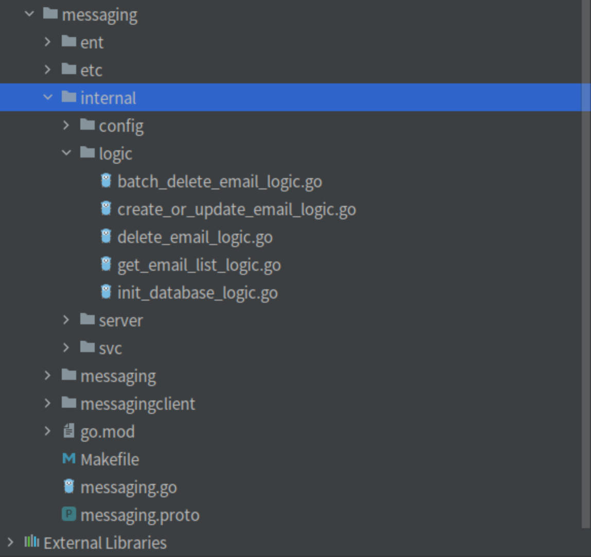

# 3 minutes developing RPC service

> Make sure that you have been installed follow software:
- simple-admin-tool (goctls) v0.1.0-beta +


## Create RPC project
> Create example project
>
```shell
goctls rpc new example --ent=true --module_name=github.com/suyuan32/simple-admin-example-rpc --go_zero_version=v1.4.2 --tool_version=v0.1.2 --port=8080  --gitlab=true
```

### Parameters

| Parameter       | Introduction                        | Usage                                                                                               |
|-----------------|-------------------------------------|-----------------------------------------------------------------------------------------------------|
| ent             | Whether to use Ent                  | true means use                                                                                      |
| module_name     | module name in  go.mod              | If your project will be used by other project, you should set as above which is a github repository |
| go_zero_version | go zero version                     | Go to [go-zero](https://github.com/zeromicro/go-zero/releases) to get the latest release            |
| tool_version    | simple admin tools version          | Go to [tool](https://github.com/suyuan32/simple-admin-tools/releases) to get the latest release     |
| gitlab          | Whether to generating gitlab-ci.yml | true means generating                                                                               |
| port            | port number                         | The service port                                                                                    |

More parameters please check `goctls rpc new --help`

> You can see the project structure:


And then edit etc/example.yaml

```yaml
Name: example.rpc
ListenOn: 0.0.0.0:8080

DatabaseConf:
  Type: mysql
  Host: 127.0.0.1
  Port: 3306
  DBName: simple_admin
  Username: root # set your username
  Password: "123456" # set your password
  MaxOpenConn: 100
  SSLMode: false
  CacheTime: 5

RedisConf:
  Host: 127.0.0.1:6379
  Type: node

Log:
  ServiceName: exampleRpcLogger
  Mode: file
  Path: /home/ryan/data/logs/example/rpc
  Encoding: json
  Level: info
  Compress: false
  KeepDays: 7
  StackCoolDownMillis: 100

Prometheus:
  Host: 0.0.0.0
  Port: 4001
  Path: /metrics

```

> Edit schema

Enter ent/schema, change example.go into student.go,  adding mixins and the fields address, uuid

```go
package schema

import (
	"entgo.io/ent"
	"entgo.io/ent/schema/field"
	"github.com/suyuan32/simple-admin-core/pkg/ent/schema/mixins"
)

// Student holds the schema definition for the Student entity.
type Student struct {
	ent.Schema
}

// Fields of the Student.
func (Student) Fields() []ent.Field {
	return []ent.Field{
		field.String("name"),
		field.Int("age"),
	}
}

func (Student) Mixin() []ent.Mixin {
	return []ent.Mixin{
		mixins.BaseMixin{},
	}
}

// Edges of the Student.
func (Student) Edges() []ent.Edge {
	return nil
}


```

> Generate Ent code

```shell
make gen-ent
```

> Generate Student CRUD logic codes

```shell
goctls rpc ent --schema=./ent/schema  --style=go_zero --multiple=false --service_name=example --o=./ --model=Student --group=student
```

| Parameters   | Introduction     | Usage                                                                                   |
|--------------|------------------|-----------------------------------------------------------------------------------------|
| schema       | Schema folder    | Input the relative path of Ent schema                                                   |
| style        | File name format | The go_zero means snack format                                                          |
| service_name | Service name     | The same as the name when use new to generate. e.g. example.go's serviceName is example |
| o            | Output path      | The output path，it can be relative path. It should target to the root path of project.  |
| model        | Model name       | The structure name in schema，e.g. the Student in example project                        |
| group        | Group Name       | The group name is used to separate logic code                                           |

More parameters please check `goctls rpc ent --help`

> model=Student means only generate structure called 'Student' in schema. If it is empty, generating all structures in schema fold.  

```shell
make gen-rpc-ent-logic model=Student

# You may need to run 
go mod tidy 
```



You can see CRUD code !

> And then you can run the code !

> Proto File code

```protobuf
syntax = "proto3";

package example;
option go_package="./example";

message Empty {}

message IDReq {
  uint64 id = 1;
}

message IDsReq {
  repeated uint64 ids = 1;
}

message UUIDReq {
  string uuid = 1;
}

message BaseResp {
  string msg = 1;
}

message PageInfoReq {
  uint64 page = 1;
  uint64 page_size = 2;
}


// Student message

message StudentInfo {
  uint64 id = 1;
  int64 created_at = 2;
  int64 updated_at = 3;
  string name = 4;
  int64 age = 5;
}

message StudentListResp {
  uint64 total = 1;
  repeated StudentInfo data = 2;
}

message StudentPageReq {
  uint64 page = 1;
  uint64 page_size = 2;
  string name = 3;
}

service Example {
  // group: base
  rpc initDatabase (Empty) returns (BaseResp);

  // Student management
  // group: student
  rpc createOrUpdateStudent (StudentInfo) returns (BaseResp);
  // group: student
  rpc getStudentList (StudentPageReq) returns (StudentListResp);
  // group: student
  rpc deleteStudent (IDReq) returns (BaseResp);
  // group: student
  rpc batchDeleteStudent (IDsReq) returns (BaseResp);
}

```

Use group comment to separate rpc logic

```shell
go run example.go -f etc/example.yaml
```

> If you see information below:
```shell
Starting server at 127.0.0.1:8080...
```

That means the codes run successfully, you need to finish the database initialization like:  [simple admin file](https://github.com/suyuan32/simple-admin-file/blob/master/api/internal/logic/file/init_database_logic.go)

> Project URL https://github.com/suyuan32/simple-admin-example-rpc

> How to call the RPC in simple admin example api

> Add config
```go
package config

import (
	"github.com/suyuan32/simple-admin-core/pkg/config"
	"github.com/zeromicro/go-zero/core/stores/redis"
	"github.com/zeromicro/go-zero/rest"
	"github.com/zeromicro/go-zero/zrpc"
)

type Config struct {
	rest.RestConf
	Auth         rest.AuthConf
	DatabaseConf config.DatabaseConf
	RedisConf    redis.RedisConf
	CasbinConf   config.CasbinConf
	ExampleRpc   zrpc.RpcClientConf
}

```

> Small website use endpoint connect directly
>
> ExampleRpc:
>  Endpoints:
>   - 127.0.0.1:8080
>
> It does not need service discovery， there can be several endpoints.

> Add example rpc in service context
### Edit service context
```go
package svc

import (
	"github.com/suyuan32/simple-admin-example-rpc/exampleclient"
	"github.com/zeromicro/go-zero/zrpc"

	"github.com/suyuan32/simple-admin-example-api/internal/config"
	i18n2 "github.com/suyuan32/simple-admin-example-api/internal/i18n"
	"github.com/suyuan32/simple-admin-example-api/internal/middleware"

	"github.com/suyuan32/simple-admin-core/pkg/i18n"

	"github.com/casbin/casbin/v2"
	"github.com/zeromicro/go-zero/core/logx"
	"github.com/zeromicro/go-zero/rest"
)

type ServiceContext struct {
	Config     config.Config
	ExampleRpc exampleclient.Example
	Casbin     *casbin.Enforcer
	Authority  rest.Middleware
	Trans      *i18n.Translator
}

func NewServiceContext(c config.Config) *ServiceContext {

	rds := c.RedisConf.NewRedis()
	if !rds.Ping() {
		logx.Error("initialize redis failed")
		return nil
	}

	cbn, err := c.CasbinConf.NewCasbin(c.DatabaseConf.Type, c.DatabaseConf.GetDSN())
	if err != nil {
		logx.Errorw("initialize casbin failed", logx.Field("detail", err.Error()))
		return nil
	}

	trans := &i18n.Translator{}
	trans.NewBundle(i18n2.LocaleFS)
	trans.NewTranslator()

	return &ServiceContext{
		Config:     c,
		Authority:  middleware.NewAuthorityMiddleware(cbn, rds).Handle,
		Trans:      trans,
		ExampleRpc: exampleclient.NewExample(zrpc.MustNewClient(c.ExampleRpc)),
	}
}
```

> And then you can call in via l.svcCtx.ExampleRpc in logic code

> simple admin example api 地址 https://github.com/suyuan32/simple-admin-example-api