## Example web 端

### Firstly, add API

simple-admin-backend-ui/src/api/sys

> Add model into simple-admin-backend-ui/src/api/sys/model 
src/api/sys/model/exampleModel.ts
```typescript
/**
 *  author: Ryan Su
 *  @description: example requst
 */
export interface HelloReq {
    name: string;
}

```
> Add example.ts into simple-admin-backend-ui/src/api/sys
```typescript
import { defHttp } from '/@/utils/http/axios';
import { ErrorMessageMode } from '/#/axios';
import { BaseResp } from '/@/api/model/baseModel';
import { HelloReq } from './model/exampleModel';

enum Api {
    Hello = '/sys-api/example/hello',
}

/**
 * @description: Get hello msg
 */

export const Hello = (params: HelloReq, mode: ErrorMessageMode = 'modal') => {
    return defHttp.post<BaseResp>(
        { url: Api.Hello, params: params },
        {
            errorMessageMode: mode,
        },
    );
};

```

> Add view :  src/view/example/index.vue

```vue
<template>
  <PageWrapper>
    <p>{{ resp }}</p>
    <AForm
      :model="name"
      name="basic"
      :label-col="{ span: 8 }"
      :wrapper-col="{ span: 16 }"
      autocomplete="off"
    >
      <AFormItem
        label="Name"
        name="name"
        :rules="[{ required: true, message: 'Please input your username!' }]"
      >
        <a-input v-model:value="name" />
      </AFormItem>

      <AFormItem :wrapper-col="{ offset: 8, span: 16 }">
        <a-button type="primary" @click="SayHello">Submit</a-button>
      </AFormItem>
    </AForm>
  </PageWrapper>
</template>
<script lang="ts" setup>
  import { PageWrapper } from '/@/components/Page';
  import { ref } from 'vue';
  import { Hello } from '/@/api/sys/example';

  const name = ref<string>('');
  const resp = ref<string>('');

  async function SayHello() {
    const result = await Hello({ name: name.value }, 'message');
    resp.value = 'Hello ' + result.msg;
    console.log(result);
  }
</script>
```

> Notice **await Hello({ name: name.value }, 'message')** 
##### message mode 
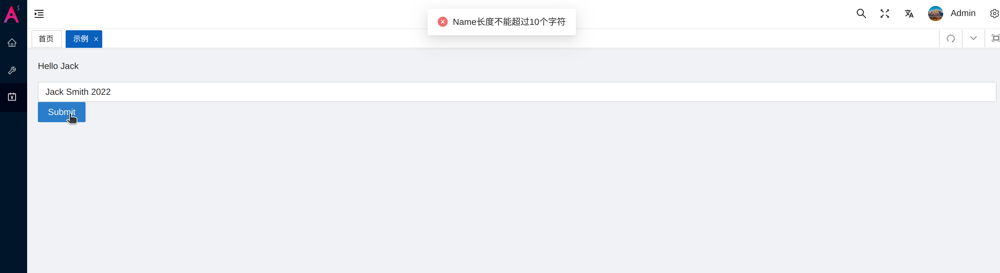
##### modal mode
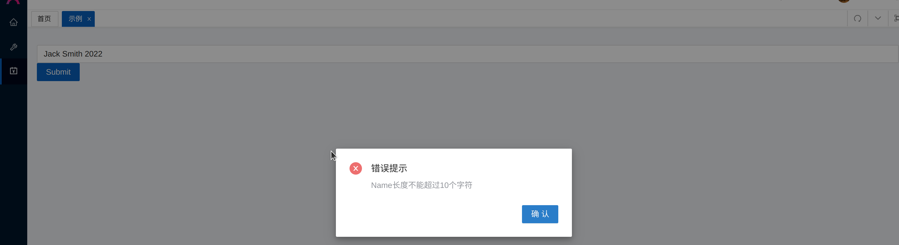


> In order to support multiple language we need to add translations into src/locals/zh-CN/routes/system.ts  and  src/locals/en/routes/system.ts

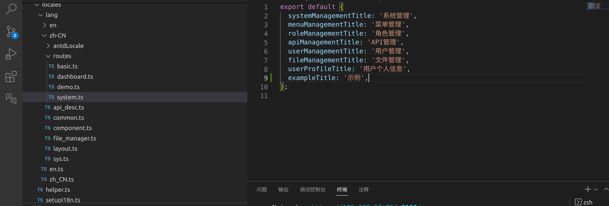
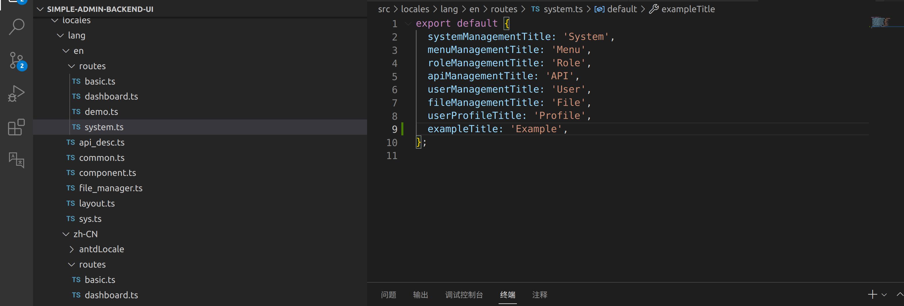

> Recommend to use i18n extension which can help you copy path easily

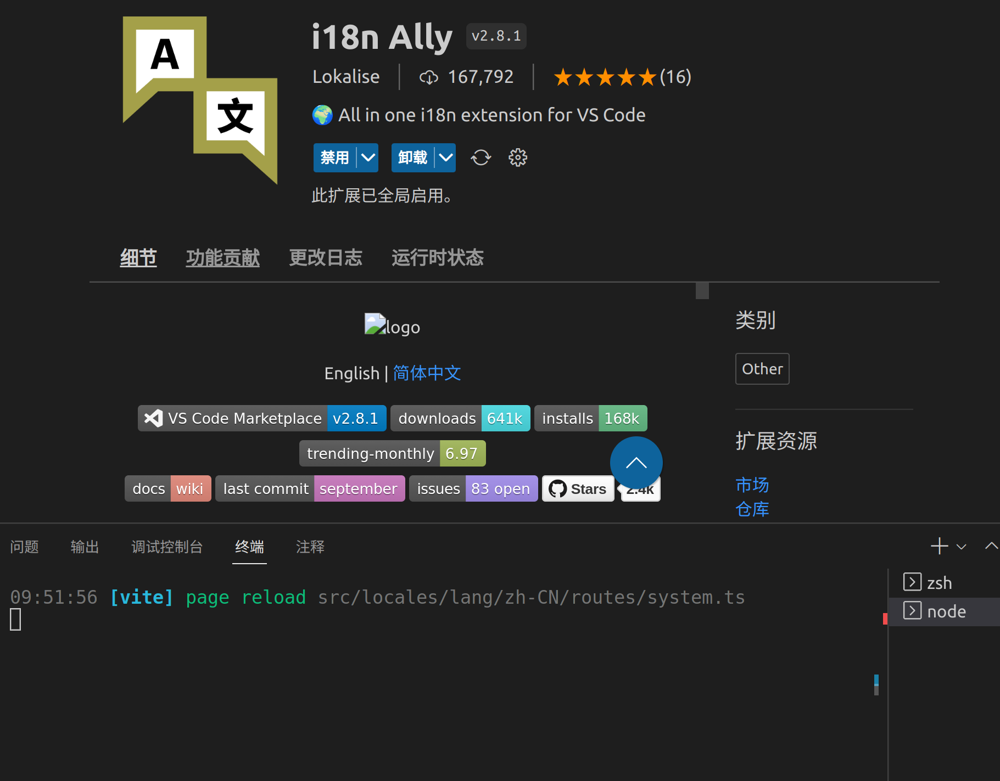
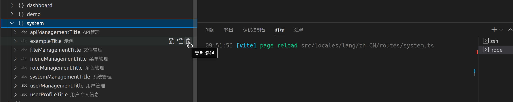

> Add menu

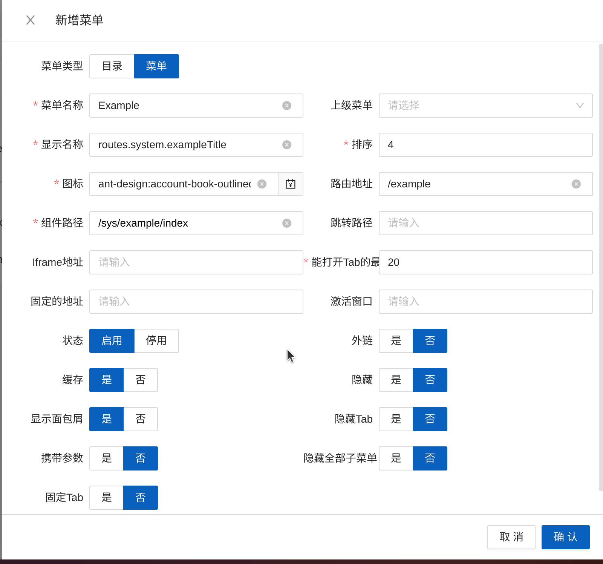

> Add menu authorization

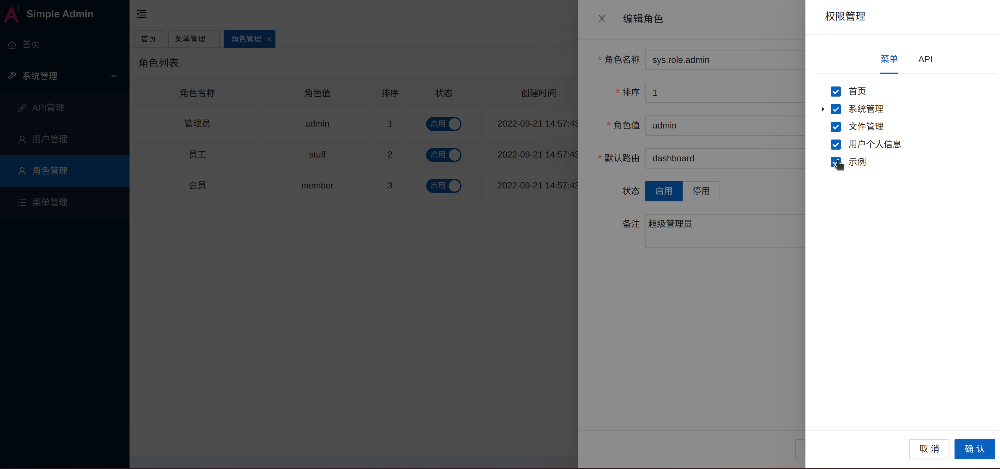

> API description also recommend to set chinese and english translation

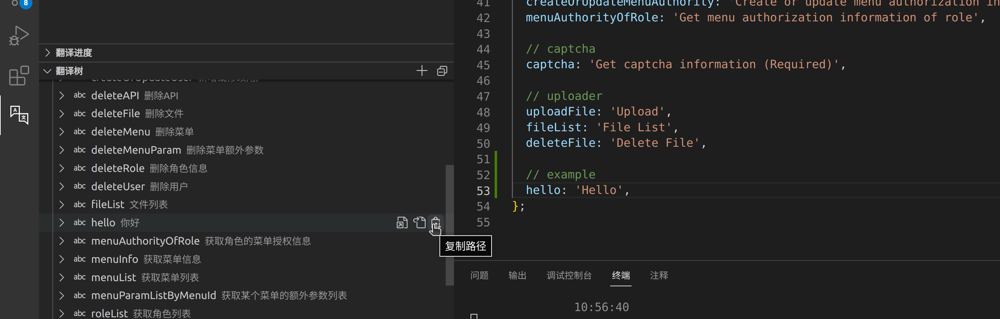
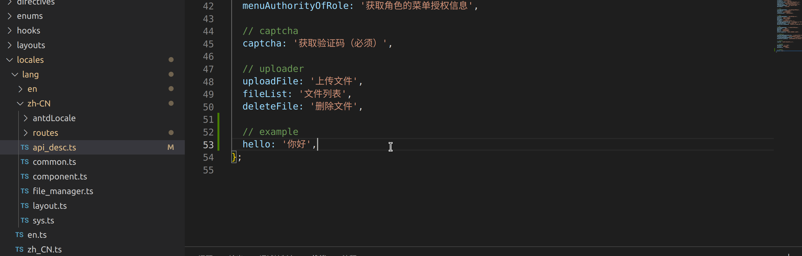

> Add API

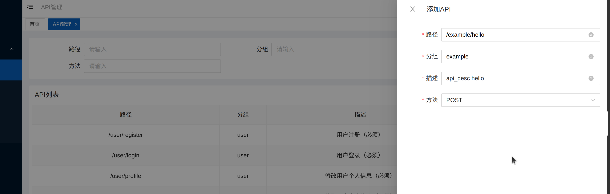

> Add API authorization

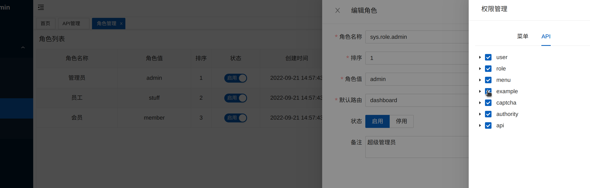

> Test page

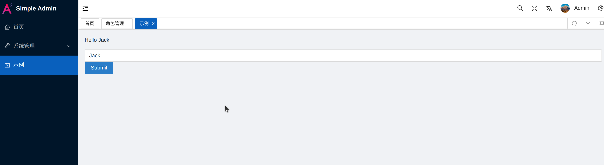

