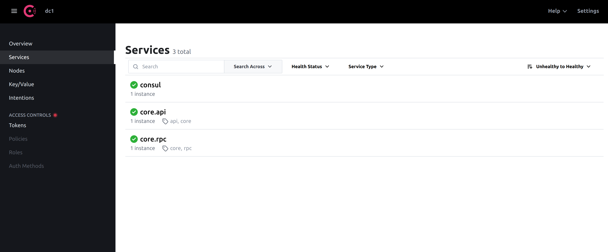
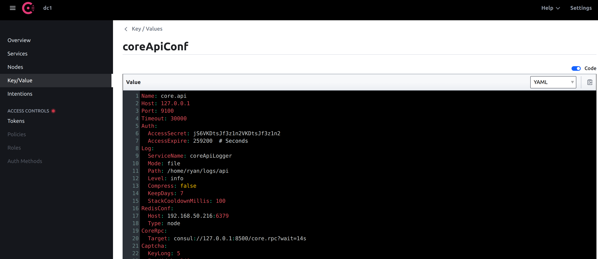

## 使用 Consul 实现服务发现和获取配置文件

### 安装consul
docker-compose 方式安装

```docker-compose
version: '2'

services:
  consul:
    image: docker.io/bitnami/consul:latest
    volumes:
      - consul_data:/bitnami/consul
    ports:
      - '8300:8300'
      - '8301:8301'
      - '8301:8301/udp'
      - '8500:8500'
      - '8600:8600'
      - '8600:8600/udp'
volumes:
  consul_data:
    driver: local
```

### 添加 Key / Value

#### key
coreApiConf

#### value
```yaml
Name: core.api
Host: 127.0.0.1
Port: 9100
Timeout: 30000
Auth:
  AccessSecret:         # longer than 8
  AccessExpire: 259200  # Seconds
Log:
  ServiceName: coreApiLogger
  Mode: file
  Path: /home/ryan/logs/core/api  # set your own path
  Level: info
  Compress: false
  KeepDays: 7
  StackCooldownMillis: 100
RedisConf:
  Host: 192.168.50.216:6379
  Type: node
CoreRpc:
  Target: consul://127.0.0.1:8500/core.rpc?wait=14s
  #Token: 'f0512db6-76d6-f25e-f344-a98cc3484d42' # consul ACL token (optional)
Captcha:
  KeyLong: 5
  ImgWidth: 240
  ImgHeight: 80
DatabaseConf:
  Type: mysql
  Path: 127.0.0.1
  Port: 3306
  Config: charset=utf8mb4&parseTime=True&loc=Local
  DBName: simple_admin
  Username: 
  Password: 
  MaxIdleConn: 10
  MaxOpenConn: 100
  LogMode: error
  LogZap: false
```

## 访问网址
http://localhost:8500

#### key
coreRpcConf

#### value

```yaml
Name: core.rpc
ListenOn: 127.0.0.1:9101
DatabaseConf:
  Type: mysql
  Path: 192.168.50.216
  Port: 3306
  Config: charset=utf8mb4&parseTime=True&loc=Local
  DBName: simple_admin
  Username: 
  Password: 
  MaxIdleConn: 10
  MaxOpenConn: 100
  LogMode: error
  LogZap: false
Log:
  ServiceName: coreRpcLogger
  Mode: file
  Path: /home/ryan/logs/core/rpc
  Level: info
  Compress: false
  KeepDays: 7
  StackCooldownMillis: 100
RedisConf:
  Host: 192.168.50.216:6379
  Type: node
```


### 修改 api/etc/core.yaml
```yaml
Consul:
  Host: 127.0.0.1:8500 # consul endpoint
  ListenOn: 127.0.0.1:9100
  #Token: 'f0512db6-76d6-f25e-f344-a98cc3484d42' # consul ACL token (optional)
  Key: core.api
  Meta:
    Protocol: grpc
  Tag:
    - core
    - api
```


### 修改 rpc/etc/core.yaml
```yaml
Consul:
  Host: 127.0.0.1:8500 # consul endpoint
  ListenOn: 127.0.0.1:9101
  #Token: 'f0512db6-76d6-f25e-f344-a98cc3484d42' # consul ACL token (optional)
  Key: core.rpc
  Meta:
    Protocol: grpc
  Tag:
    - core
    - rpc
```




