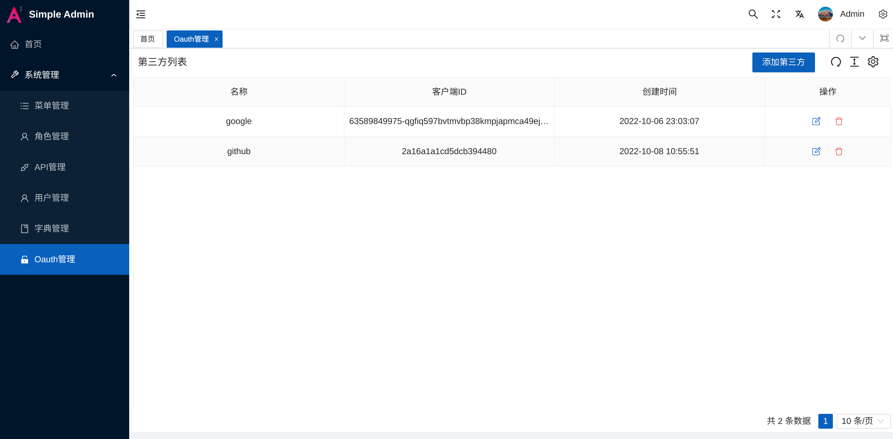

# Oauth

> 目前系统已默认提供 google 和 github Oauth 登录功能

> 如何获取 clientID 和 client secret?
[google](https://developers.google.com/identity/protocols/oauth2)
[github](https://docs.github.com/en/developers/apps/building-oauth-apps/authorizing-oauth-apps)

> 添加第三方



> 编辑 src/views/sys/login/LoginForm.vue

```html
<div class="flex justify-evenly enter-x" :class="`${prefixCls}-sign-in-way`">
  <GithubFilled @click="oauthLoginHandler('github')" />
  <WechatFilled />
  <AlipayCircleFilled />
  <GoogleCircleFilled @click="oauthLoginHandler('google')" />
  <TwitterCircleFilled />
</div>
```

> 添加对应的provider名称即可。
> param 模式是将请求放在网址中
> header 模式是将请求放在 authorization 内