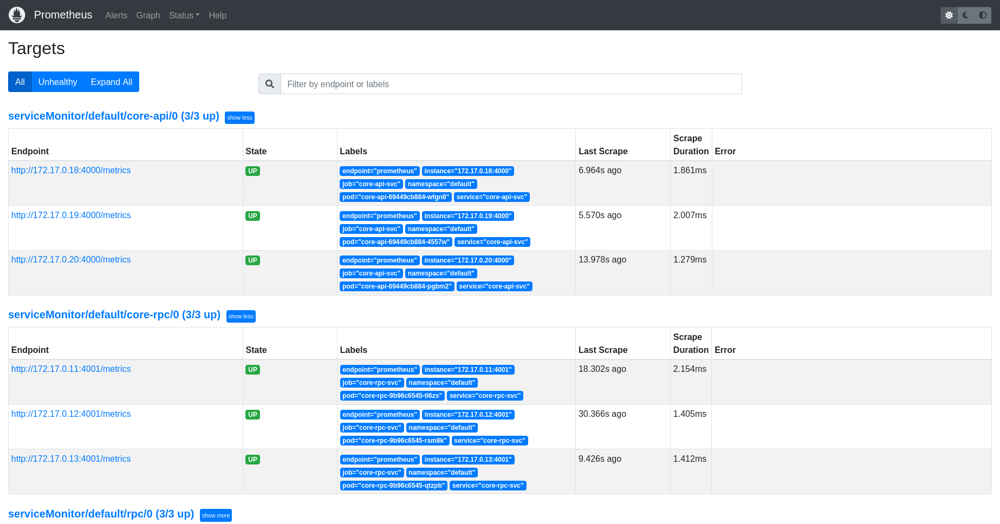

# 服务监控

## 我们使用 Prometheus 进行服务监控

> 安装 Prometheus

[安装方法](https://prometheus-operator.dev/docs/prologue/quick-start/)

> 安装好后进入 simple-admin-core/deploy/k8s/prometheus

```shell
# 运行
sh setup.sh
```

> 访问 http://localhost:9090 \
> 查看 status - targets 

