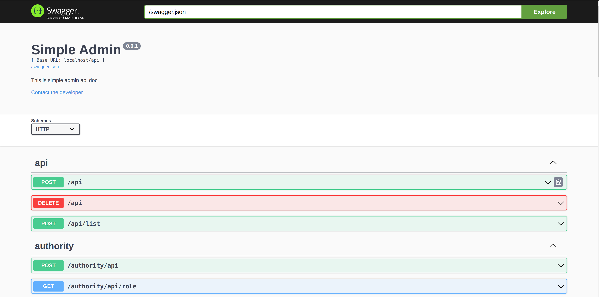
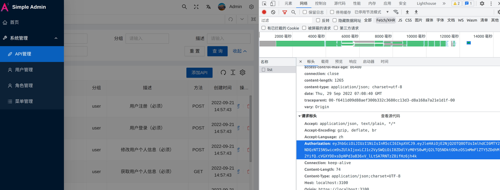
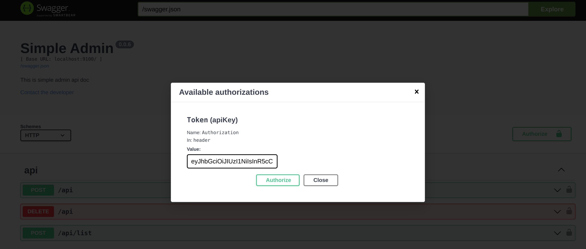

## 使用swagger

> 环境配置

[go-swagger](https://zhuanlan.zhihu.com/p/556171256?)

> 在项目根目录运行 simple-admin-core/

```shell
swagger generate spec --output=./core.yml --scan-models

swagger serve --no-open -F=swagger --port 36666 core.yaml
```



> 获取 Token 
> 
> 先登录系统，在任意请求中复制 authorization



> 粘贴到 swagger




